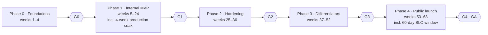

# Taskiem — Phased Build Plan

Oct 5, 2026 · @EaziDeFi

Taskiem (working name) reaches public launch in five gated phases over roughly 16 months (68 weeks), with the trust and compliance core proven inside holdco products before anything is sold. Each phase ends at a gate with measurable criteria; the next phase starts only when the gate passes. Phase durations include the time each gate's own soak or availability window needs, so a gate is never scheduled to pass before its criteria can be measured.

## Roadmap

| Phase | Weeks | Duration |
| --- | --- | --- |
| 0 — Foundations | 1–4 | 4 |
| 1 — Internal MVP | 5–24 | 20 (16 build and go-live, 4 soak) |
| 2 — Hardening | 25–36 | 12 |
| 3 — Differentiators | 37–52 | 16 |
| 4 — Public launch | 53–68 | 16 (6 build, 10 public beta covering the 60-day SLO window) |

Phase 1 is the critical one: if the engine cannot prove zero duplicate effects under chaos testing, nothing after it is worth building. Architecture references in this plan point to sections of the companion Architecture Specification.

## Phase 0 — Foundations (about 4 weeks)

Phase 0 sets up the legal, technical, and process ground so that everything built afterwards is clean, testable, and multi-tenant from the first commit. No user-facing features ship in this phase.

### Scope

- **Clean-room setup.** Written clean-room policy (section "Working practices"), contributor IP assignment agreements, CI licence scanner with an allow-list, and a decision log for every design choice that resembles an existing product.
- **Naming.** Run trademark searches for the working name Taskiem in Nigeria (and Ghana, Kenya if targeted), with a shortlist of alternatives in case it is not clear.
- **Repository and CI.** Monorepo (`engine/`, `web/`, `sdk/`, `connectors/`, `deploy/`), Go and TypeScript linting, unit test runners, SBOM generation, signed builds.
- **Schema v0.** Migrations for tenants, users, memberships, workflows, workflow versions, runs, run events (partitioned by run start), tasks (with `lease_epoch`), timers, trigger receipts, subject keys, audit log, and audit chain heads, with RLS enabled from day one and the `taskiem_dispatch` claim functions (spec 5.3) as the only cross-tenant path.
- **Specs frozen for Phase 1.** `wd/v1` JSON Schema draft, `connector/v1` manifest schema draft, the action-class contract, and the idempotency key derivation and encoding contract (spec 4.4).
- **Engine spike.** A throwaway prototype of `decide()` plus the `SKIP LOCKED` queue and dispatch functions, load-tested and profiled to validate the Postgres-as-queue choice before building on it.
- **Dogfood selection.** Pick 3 real workflows from holdco products (for example, a Payrolla salary disbursement, an iSpend wallet top-up reconciliation, an ops alert) as the Phase 1 acceptance tests.

### Exit gate G0

- [ ] Clean-room policy signed by every contributor
- [ ] Licence scanner blocking non-allow-listed dependencies in CI
- [ ] Engine spike sustains at least 200 steps/s on one Postgres instance in a load test
- [ ] A profile of the spike names its bottlenecks and gives a written, evidence-based projection of reaching the G1 target of 500 steps/s on target hardware; if the projection falls short, the queue design is revisited before Phase 1 starts
- [ ] Three dogfood workflows written down as WD drafts with expected behaviour

## Phase 1 — Internal MVP (about 20 weeks)

Phase 1 delivers a working platform that runs real money-adjacent workflows inside holdco products, with the durable engine and approvals in place from the start. It is not sold externally; its job is to prove the core under real load. The scope is sized for the Phase 1 team of four (one frontend engineer): anything the three dogfood workflows do not need is deferred.

### Deliverables

| Area | Deliverable | Spec section |
| --- | --- | --- |
| Engine | Event-sourced runs, deterministic `decide()`, Postgres queue with leases and fencing tokens, dispatch functions, timers, signals, retries | 4, 5.3 |
| Engine | Action classes, derived and encoded idempotency keys, `EffectIntent`, reconcile hook, `needs_reconciliation` state; connector versions pinned per run | 4.4, 6.4 |
| Engine | Compensation (sagas) and `concurrency_key` | 4.7, 4.8 |
| Definitions | `wd/v1` with step types: connector, http, code (JS), branch, foreach, wait, signal, approval, transform | 3 |
| Expressions | CEL integration with cost limits | 3.3 |
| Triggers | Webhook, schedule, manual/API, connector webhooks; dedup ingest pipeline | 8 |
| Sandbox | QuickJS in wazero with memory, CPU, and egress limits | 7 |
| Connectors | SDK v1 (in-process Go); five connectors: Paystack, Smile ID or Dojah, Termii, Postgres, HTTP (Slack alerts go through HTTP incoming webhooks) | 6 |
| Governance | Approval step with role, count, self-approval ban, timeout; web approvals; hash-chained audit log with serialised per-tenant appends | 9.1, 9.2 |
| Privacy | Declared PII fields encrypted under per-subject keys before write, so every Phase 1 run can later be erased | 4.9, 9.4 |
| Retention | Retention counted from run end; archive job; partitions dropped only when empty | 9.4 |
| Security | Envelope-encrypted secrets via OpenBao, egress proxy with allow-lists, RLS enforced | 14 |
| Tenancy | Tenants, workspaces, environments (dev, prod), built-in roles | 13 |
| UI | Canvas (React Flow), step config forms from schemas, run inspector, connections page | 15.1 |
| Ops | Single-binary roles, Docker Compose, OpenTelemetry traces, Prometheus metrics | 15 |

### Deferred to later phases

These items are deferred, not dropped. Phase 1 proves the engine moves money without duplicate or lost effects; each item below either builds on that core or only matters once external customers arrive.

| Item | Lands in | Why it waits |
| --- | --- | --- |
| Code SDK and Git sync | Phase 2 | Compiles to the WD format, which needs to stabilise through Phase 1 dogfooding |
| PII auto-detection | Phase 2 | Declared PII fields suffice for internal workflows; detection matters once customer data flows through |
| `parallel` step type | Phase 2 | The dogfood workflows need `foreach` but not `parallel`; it reuses the same join machinery |
| Live run view on the canvas | Phase 2 | The run inspector covers debugging; live view is polish the single Phase 1 frontend engineer cannot also carry |
| Flutterwave, WhatsApp (send), Slack, Gmail connectors | Phase 2 | Not needed by the dogfood workflows; they join the Phase 2 connector push |
| Python sandbox | Phase 2 | JavaScript covers early needs; the CPython WASI build is heavier work |
| WhatsApp approvals | Phase 3 | Reuses the approval engine and signed-token model from Phases 1–2 |
| AI features | Phase 3 | Validates against the WD schema, policies, and test framework, which must exist first |
| Embedding | Phase 3 | Tenant model supports it from day one; partner-facing pieces wait until the core is proven |
| USSD | Phase 3 | Needs the fast path and an aggregator partnership |
| Billing | Phase 4 | Nothing to bill until external self-serve launch |

### Milestones inside the phase

1. **Weeks 1–6:** engine core passes the determinism and crash-recovery test suite.
2. **Weeks 4–10:** connector SDK and first five connectors; sandbox.
3. **Weeks 7–13:** canvas, inspector, approvals, audit log.
4. **Weeks 13–16:** dogfood workflows live in production for holdco products; bug-fix, chaos test, and load test.
5. **Weeks 17–20:** four-week production soak with no feature work beyond fixes; G1 is assessed at the end of week 20.

### Exit gate G1

- [ ] The three dogfood workflows run in production for 4 consecutive weeks
- [ ] Chaos test: workers killed at random during 10,000 payment-shaped runs produce zero duplicate and zero lost effects
- [ ] Sustained 500 steps/s in a load test on the target hardware, p95 dispatch under 50 ms
- [ ] Audit chain verifies end to end with the CLI verifier
- [ ] No open critical security findings from an internal review

## Phase 2 — Hardening (about 12 weeks)

Phase 2 makes the platform fit for the first external design partners: regulated fintechs who need code workflows in Git, full compliance controls, and a deeper African connector library. At its end the platform is sellable to a small number of hand-held customers.

### Deliverables

| Area | Deliverable | Spec section |
| --- | --- | --- |
| Code and Git | TypeScript SDK, compiler to WD, deterministic codegen from canvas, three-way merge | 10.1, 10.2 |
| Code and Git | GitHub and GitLab integration, platform-led and Git-led modes | 10.3 |
| CLI | `taskiem` validate, test, dev, diff, deploy, runs tail | 10.4 |
| Engine | `parallel` step type | 3.2 |
| Testing | Workflow test framework with mocked connector outputs, required in CI | 10.5 |
| Governance | Policy objects with amount thresholds, multi-level approvers, escalation, delegation, step-up (passkey, TOTP) | 9.1 |
| Governance | Four-eyes on publishing to production and on policy edits | 9.1 |
| Privacy | PII declaration in schemas plus Nigerian-identifier detectors, redaction in UI, logs, exports; `pii.reveal` permission | 9.3 |
| Privacy | Retention policies and crypto-shredding for erasure | 9.4 |
| Compliance | Compliance reports and audit-chain anchoring | 9.2, 9.6 |
| Connectors | WASM runtime for third-party connectors; contract-drift monitor | 6.3, 6.4 |
| Connectors | African (13): Flutterwave, Moniepoint, Interswitch, Opay, Remita, NIBSS via partner, Mono, Okra, Stitch, Prembly, Youverify, whichever of Smile ID or Dojah Phase 1 skipped, Africa's Talking SMS. Global: WhatsApp (send), Slack, Gmail, Google Sheets, MySQL, S3, SFTP | 6.5 |
| Sandbox | Python (CPython WASI) | 7.1 |
| Identity | Passkeys default for admins, SSO (OIDC, SAML), SCIM, custom roles | 13.2, 13.3 |
| Ops | Staging environment support, alerts to email and Slack, dashboards, live run view on the canvas | 15.1 |
| Security | First external penetration test | 14.4 |

### Exit gate G2

- [ ] At least 2 external design partners (regulated fintechs or MFBs) running production workflows
- [ ] Penetration test complete with all critical and high findings fixed
- [ ] A design partner's compliance or risk team has reviewed the approval and audit features and signed off on them
- [ ] Code-to-canvas round trip is lossless across the full workflow test suite
- [ ] At least 15 African connectors live with fixtures and nightly sandbox checks (3 from Phase 1 plus 13 planned in Phase 2 gives one spare against a partner API falling through)

## Phase 3 — Differentiators (about 16 weeks)

Phase 3 builds the three features no competitor combines: WhatsApp as a full interface, AI that builds and repairs workflows, and embedding for other SaaS products. They come after hardening because each depends on the stable WD, policies, and audit log from Phases 1 and 2.

The three workstreams run in parallel with separate owners.

### Workstream A — WhatsApp and USSD

| Deliverable | Spec section |
| --- | --- |
| Number binding by OTP, `chat_sessions` state machine, template library | 11.2, 11.3 |
| Approvals by interactive buttons with signed tokens; step-up via WhatsApp Flows PIN or web passkey hand-off | 11.1, 9.1 |
| Trigger and status commands with intent matching and explicit confirmation | 11.1 |
| Shared platform number and own-number onboarding | 11.4 |
| USSD fast path and aggregator connector | 8.4 |
| Pidgin, Yoruba, Hausa, Igbo support and voice-note transcription (beta, native-speaker tested) | 11.6 |

### Workstream B — AI builder and repair

| Deliverable | Spec section |
| --- | --- |
| Provider-agnostic model layer, redaction before prompts, per-tenant budgets | 12.3 |
| Builder pipeline: retrieval, schema-constrained draft, validate, self-correct, dry run, generated tests | 12.1 |
| Repair pipeline: failure classification, shadow-sandbox fork, one-click publish and resume | 12.2 |
| Evaluation suite of 200+ requests seeded from dogfooding and design partners | 12.4 |
| SME template library and chat-based building on WhatsApp | 11.1 |

### Workstream C — Embedding

| Deliverable | Spec section |
| --- | --- |
| Sub-tenants, `embed_apps`, end-user token minting API | 13.1, 13.4 |
| Embedded builder web component and iframe, theming tokens, custom domains | 13.4 |
| Partner connector bridge and partner admin API with webhooks | 13.4 |
| Headless mode | 13.4 |
| First embedded deployment inside a holdco product (for example, Payrolla customer automations) | — |

### Also in Phase 3

Container steps on gVisor or Firecracker for heavy workloads (7.5), mobile money connectors (M-Pesa, MTN MoMo, Airtel Money), and tax and statutory connectors where partner APIs exist.

### Exit gate G3

- [ ] At least 50 real approvals completed through WhatsApp by design-partner users
- [ ] AI builder produces a valid, test-passing workflow on the first attempt for at least 70% of the evaluation suite
- [ ] At least one failed production run repaired through the shadow-sandbox flow and resumed
- [ ] One holdco product running embedded automations for its own customers
- [ ] No AI action able to publish, approve, or read secrets, confirmed by a security review

## Phase 4 — Public launch (about 16 weeks)

Phase 4 turns a hand-held product into a self-serve cloud: Nigeria-hosted, highly available, with flat-priced plans anyone can sign up for. The engineering work shifts from features to scale, reliability, billing, and onboarding. Weeks 1–6 build the production cloud, billing, and onboarding; weeks 7–16 run a public beta on that cloud, which covers the 60-day availability window G4 requires before general availability.

### Deliverables

| Area | Deliverable | Spec section |
| --- | --- | --- |
| Cloud | Nigeria-region production cloud: HA Postgres with synchronous standby, PITR, fixed egress IPs | 2.3, 15.4 |
| Scale | Workers split by queue, dedicated worker pools for enterprise, read replicas for the inspector; JetStream migration only if load tests require it | 2.3, 4.3 |
| Billing | Plans, subscriptions, capacity enforcement (concurrency, throughput, retention), usage snapshots, naira payments | 16 |
| Onboarding | Self-serve signup, guided first workflow, template gallery, in-product docs | — |
| Docs | Public docs site, API reference, connector SDK guide, all written originally | — |
| Ecosystem | Public connector SDK and submission review process for third-party connectors | 6 |
| Enterprise | BYOK, dedicated single-tenant deployments, white-label tier | 13.4, 14.1 |
| Reliability | 99.9% availability SLO with on-call rotation, status page, incident process | 15.3 |
| Trust | Bug bounty, security page, start of ISO 27001 and SOC 2 Type II preparation | 14.4 |
| Legal | Counsel IP review, final trademark registration, terms of service, DPA under NDPA | — |

### Go-to-market sequence

1. Convert design partners to paid Business or Enterprise plans.
2. Launch Starter and Growth tiers to SMEs, with WhatsApp onboarding as the primary entry point.
3. Open the embedded tier to SaaS companies outside the holdco.

### Exit gate G4 (launch complete)

- [ ] 99.9% availability held for 60 days before general availability
- [ ] Self-serve signup to first successful run in under 15 minutes for a new user
- [ ] At least 10 paying external tenants across at least two tiers
- [ ] Counsel IP review and trademark filing complete

## Pillar coverage by phase

Every pillar is designed in from Phase 0, but each one becomes complete in a specific phase. The trust and compliance pillars come first because the others build on them.

| Pillar | Phase 1 | Phase 2 | Phase 3 | Phase 4 | Complete in |
| --- | --- | --- | --- | --- | --- |
| 1. Trustworthy execution | Engine, action classes, sagas | Contract-drift monitor | Container steps | Scale-out, dedicated pools | Phase 1 (core) |
| 2. Compliance-native | Approvals, audit chain, RLS | Policies, step-up, PII, retention, reports | WhatsApp approvals | BYOK, certifications | Phase 2 |
| 3. African connectors | 5 core connectors (3 African) | 15+ African connectors, WASM SDK | Mobile money, USSD, tax | Public SDK, third-party submissions | Ongoing |
| 4. Visual and code sync | Canvas on WD | SDK, codegen, Git, CLI, tests | AI writes tests | — | Phase 2 |
| 5. WhatsApp interface | — | Send-only connector | Approvals, commands, building, languages | SME onboarding entry point | Phase 3 |
| 6. AI build and repair | — | — | Builder, repair, eval suite | Template gallery | Phase 3 |
| 7. Embedding | Tenant model ready | — | Sub-tenants, web component, partner API | White-label tier | Phase 3 |
| 8. Flat pricing | — | — | — | Plans and capacity enforcement | Phase 4 |

## Team and staffing

The durations in this plan assume a core team of 4 engineers in Phases 0–1, growing to about 9 by Phase 3, with the founder acting as product lead and architect. A smaller team stretches each phase roughly in proportion; the order of phases should not change.

| Role | Phase 0–1 | Phase 2 | Phase 3 | Phase 4 |
| --- | --- | --- | --- | --- |
| Founder (product and architecture) | 1 | 1 | 1 | 1 |
| Senior Go engineer, engine | 2 | 2 | 2 | 2 |
| Go engineer, connectors | 1 | 2 | 2 | 2 |
| Frontend engineer (React, canvas) | 1 | 1 | 2 | 2 |
| Security and platform engineer | — | 1 | 1 | 2 |
| AI engineer | — | — | 1 | 1 |
| Partnerships and compliance lead | part-time | 1 | 1 | 1 |
| Developer relations and docs | — | — | part-time | 1 |
| Support and success | — | — | — | 1–2 |

### Estimated timeline

Phase 0 about 4 weeks, Phase 1 about 20 (including the 4-week soak), Phase 2 about 12, Phase 3 about 16, Phase 4 about 16 (including the 60-day SLO window): 68 weeks, roughly 16 months from start to public launch. These are planning estimates, not commitments; Phase 1's chaos and load results are the first real checkpoint for re-planning.

### Budget items to cost

- Engineering salaries by role and phase
- Nigeria-region hosting (or capacity from the VPS business) and backups
- External penetration tests (Phase 2 and annually)
- Legal: IP review, trademark filings, terms, NDPA data processing agreements
- WhatsApp Business Platform message costs during design-partner testing
- AI model usage for the builder, repair, and evaluation suite
- Partner fees for NIBSS access and identity providers

## Working practices

Three practices protect the project throughout: a clean-room discipline that keeps the codebase provably original, a testing regime focused on the engine's guarantees, and a steady release cadence. These rules apply from Phase 0 and are not relaxed later.

### Clean-room rules

1. **No source reading.** Engineers do not read the source code of n8n, Zapier, Make, Activepieces, Windmill, Temporal, or similar products while working on the platform. Public user docs, pricing pages, and product demos are fine for understanding what users expect.
2. **No copying artefacts.** No code, connector definitions, node JSON, UI layouts, icons, docs text, or error messages from other products.
3. **Original naming.** Product name, step type names, and UI terms are chosen independently and checked against competitors' trademarks.
4. **Decision log.** When a design resembles an existing product, record why it was chosen and that it was derived independently (for example, event sourcing comes from public literature, not a competitor's code).
5. **Licence gate.** Only allow-listed licences enter the dependency tree, under the two-tier policy in spec section 17: MIT, Apache 2.0, BSD, ISC, and PostgreSQL for anything linked or bundled; MPL 2.0 and AGPL 3.0 additionally for unmodified upstream software run as a separate, optional service. The CI scanner enforces it.
6. **IP assignment.** Every employee and contractor signs an IP assignment and a clean-room acknowledgement before their first commit.

This is a practical outline, not legal advice; counsel should review the policy in Phase 0 and the codebase before launch.

### Testing

- **Determinism suite:** replaying any recorded run history must produce the same commands, byte for byte.
- **Crash suite:** kill workers, orchestrators, and the database primary at random points during payment-shaped runs; assert zero duplicate and zero lost effects.
- **Fencing suite:** pause workers past their lease (SIGSTOP), let another worker take the task, then resume the first; assert its writes are rejected and no second effect is sent.
- **Connector fixtures** replayed in CI, live sandbox checks nightly.
- **Load tests** at each phase gate against the targets in spec section 4.11.
- **Security tests:** RLS bypass attempts (including through the dispatch functions and partner sub-tenant scope), sandbox escape attempts, SSRF probes through the egress proxy, in CI.

### Release cadence

- Trunk-based development with feature flags; main is always deployable.
- Internal production (holdco dogfooding) deploys continuously from Phase 1.
- Design partners receive weekly releases from Phase 2 with a changelog.
- Breaking changes to `wd/v1` or `connector/v1` require a new schema version and a migration tool; existing workflows never break silently.
