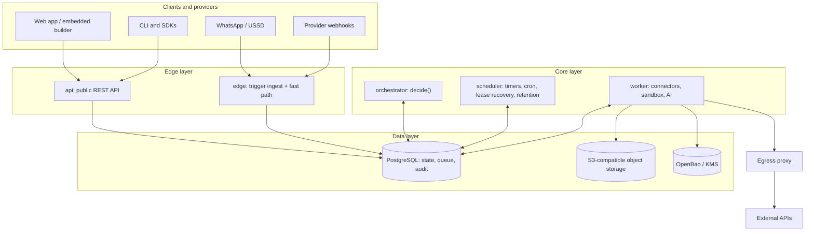

# Taskiem — Architecture Specification

Oct 5, 2026 · @EaziDeFi

## 1. Overview

Taskiem (working name, pending trademark search; see section 18.2) is a workflow automation engine that regulated businesses can trust with money movement. It is built from scratch in Go on PostgreSQL, owns all of its code, and is hosted in Nigeria. It combines a visual builder with a durable execution core, compliance controls, and first-class African integrations.

### 1.1 Target users

| Segment | Example | Core need |
| --- | --- | --- |
| Regulated fintechs and MFBs | Lenders, payroll providers, wallets | Reliable money flows with audit trails and approvals |
| SaaS companies | Payroll, HR, accounting tools | Embedded automation their own customers can use |
| SMEs and informal businesses | Retailers, cooperatives, agents | Simple automations run from WhatsApp |
| Internal ops teams | Holdco portfolio companies | Back-office glue without custom services |

### 1.2 Goals (the eight pillars)

1. **Trustworthy execution.** Durable, replayable runs with idempotent steps and exactly-once external effects.
2. **Compliance-native.** Maker-checker approvals, tamper-evident audit logs, PII redaction, and Nigerian data residency.
3. **African integration library.** First-party connectors for local payments, identity, messaging, and banking rails.
4. **Visual and code in sync.** One canonical workflow format that the canvas and a code SDK both read and write, versioned in Git.
5. **WhatsApp as an interface.** Trigger, approve, and monitor workflows from chat.
6. **AI build and repair.** Generate workflows from plain language and diagnose failed runs.
7. **Embeddable and white-label.** Other SaaS products embed the builder for their own customers.
8. **Flat pricing.** Plan tiers limit resources and concurrency, never per-execution counts.

### 1.3 Non-goals

- Not a general data pipeline or ETL tool for terabyte-scale batch jobs.
- Not a replacement for a core banking system or ledger. The platform orchestrates them.
- Not a low-latency stream processor. Target step latency is tens of milliseconds, not microseconds.
- No fork or derivative of any existing workflow product. All code, connector definitions, UI, and docs are original.

### 1.4 Design principles

- **Every effect is recorded before it is trusted.** A step's result exists only once it is committed to the run history.
- **One source of truth for a workflow.** Canvas, code, AI, and WhatsApp all edit the same versioned definition.
- **Multi-tenant from the first migration.** Every table carries a tenant key; isolation is enforced in the database, not only in code.
- **Boring infrastructure.** PostgreSQL is the queue, the state store, and the audit store until load proves otherwise.
- **Single binary, many roles.** One Go binary runs as API, scheduler, or worker by flag, so a small install is one process and a large one scales each role.
- **Safe by default.** Secrets encrypted, PII redacted in logs, custom code sandboxed, outbound calls allow-listed per tenant.

## 2. System architecture

The platform is one Go binary that runs as any of five roles, with PostgreSQL as the single source of truth for state, queueing, and audit. A small install runs every role in one process; a large one scales each role independently behind a load balancer.



Requests flow top to bottom: clients and providers hit the edge, the edge records events, the core decides and executes, and every outbound call leaves through the egress proxy.

### 2.1 Components

| Component | Role flag | Responsibility |
| --- | --- | --- |
| Public API | `api` | REST API for UI, CLI, SDKs, partners; auth, RBAC, rate limits |
| Trigger ingest | `edge` | Verify, deduplicate, and record inbound events; acknowledge fast |
| Fast path | `edge` | Low-latency USSD menus and chat sessions |
| Orchestrator | `orchestrator` | Sweep runs with undecided events and run `decide()`; most decisions run inline where the event is appended (section 4.2) |
| Scheduler | `scheduler` | Fire timers and cron, recover expired leases, run retention jobs |
| Workers | `worker` | Execute steps: connector calls, sandboxed code, AI calls |
| Web app | static | React canvas, run inspector, admin, served from a CDN or the API |
| Egress proxy | sidecar | Allow-listed, logged, SSRF-safe outbound traffic with fixed IPs |

### 2.2 Life of a run

1. A provider webhook arrives at ingest, which verifies the signature and checks the dedup key.
2. Ingest writes `RunStarted` and triggers the first orchestrator pass in one transaction, then returns 202.
3. The orchestrator reads the history, decides the first step is ready, and writes `StepScheduled` plus a task.
4. A worker claims the task with `SKIP LOCKED`, receiving a lease epoch (fencing token); it writes `EffectIntent` and calls the provider through the egress proxy with a deterministic idempotency key.
5. The worker writes `StepCompleted`, which is accepted only if its lease epoch is still current (section 4.3), and runs the next orchestrator pass in the same transaction; the loop repeats.
6. At an approval step the orchestrator writes `ApprovalRequested`; the run sleeps at zero cost until a signed decision arrives from the web or WhatsApp.
7. When no steps remain, the orchestrator writes `RunCompleted`.

### 2.3 Deployment topology

| Size | Topology |
| --- | --- |
| Dev and self-hosted single node | One binary with all roles, Postgres, SeaweedFS, OpenBao via Docker Compose |
| Cloud v1 (Nigeria region) | 2× api/edge, 2× orchestrator, 1–2× scheduler (leader-elected), N× workers by queue; Postgres primary plus synchronous standby |
| Cloud at scale | Workers split by queue (connector, sandbox, AI, dedicated tenants); read replicas for inspector queries; queue moved to NATS JetStream if needed |
| Enterprise dedicated | Single-tenant stack in the customer's chosen region or on their infrastructure |

Scheduler instances use a session-level Postgres advisory lock for leader election, so only one fires timers at a time while others stand by. The lock is held on a dedicated, direct connection (never through a transaction-pooling proxy such as PgBouncer), and the leader re-checks it before each batch so a lost connection cannot leave two leaders.

## 3. Workflow definition format

Every workflow is stored as one canonical, versioned JSON document called the Workflow Definition (WD). The canvas, code SDKs, AI builder, and WhatsApp interface are all editors of the WD; none of them stores its own format.

### 3.1 Structure

A WD is a directed graph of steps plus metadata. Loops and parallelism are explicit step types, not implicit graph cycles, which keeps replay deterministic.

```json
{
  "schema": "wd/v1",
  "id": "wf_01J9...",
  "version": 7,
  "name": "Disburse approved loan",
  "trigger": {
    "type": "webhook",
    "config": { "path": "/loans/approved", "auth": "hmac" }
  },
  "inputs": { "schema": { "$ref": "#/types/LoanApproved" } },
  "steps": [
    {
      "id": "verify_bvn",
      "type": "connector",
      "connector": "smileid@2",
      "action": "verify_bvn",
      "input": { "bvn": "=trigger.body.bvn" },
      "retry": { "max": 3, "backoff": "exponential", "initial": "2s" }
    },
    {
      "id": "approve",
      "type": "approval",
      "needs": ["verify_bvn"],
      "config": { "policy": "maker_checker", "role": "credit_officer", "timeout": "24h" }
    },
    {
      "id": "pay",
      "type": "connector",
      "connector": "paystack@1",
      "action": "transfer",
      "needs": ["approve"],
      "when": "=steps.approve.output.decision == 'approved'",
      "input": {
        "amount": "=trigger.body.amount_kobo",
        "recipient": "=trigger.body.recipient_code"
      },
      "effect": { "idempotency_seed": "=trigger.body.loan_id" }
    }
  ],
  "types": { "LoanApproved": { "type": "object", "properties": { } } },
  "settings": { "timeout": "72h", "concurrency_key": "=trigger.body.borrower_id" }
}
```

`effect.idempotency_seed` is optional. When set, it replaces the run id in the idempotency key, so a business identifier (here the loan id) deduplicates the payment across runs as well as within one. The engine always derives and encodes the final key itself (section 4.4); a workflow never supplies a raw provider reference.

### 3.2 Step types

| Type | Purpose |
| --- | --- |
| `connector` | Call an action on an installed connector |
| `code` | Run sandboxed JavaScript, Python, or Go-compiled WASM |
| `http` | Raw HTTP request with templated headers and body |
| `branch` | Route to one of several paths by condition |
| `parallel` | Run child paths concurrently, join on all or any |
| `foreach` | Map a sub-flow over a list with a concurrency cap |
| `wait` | Sleep for a duration or until a timestamp |
| `signal` | Pause until an external event arrives (webhook, WhatsApp reply) |
| `approval` | Human decision under a governance policy |
| `subflow` | Call another workflow, pinned to a version |
| `transform` | Pure data mapping with expressions, no side effects |
| `ai` | LLM call with a typed output schema |

### 3.3 Expressions

Strings starting with `=` are expressions. The language is CEL (Common Expression Language) via the Apache-2.0 `cel-go` library. CEL is side-effect free, non-Turing-complete, and has bounded cost, so expressions cannot hang a worker or leak data. Available roots are `trigger`, `steps.<id>.output`, `run`, `env` (tenant variables), and `secrets` (resolved only at execution, never logged).

### 3.4 Versioning and lifecycle

- Every save creates an immutable version. Runs are pinned to the version they started on, so an edit never changes an in-flight run.
- States: `draft` → `published` → `deprecated` → `archived`. Only published versions accept triggers.
- Publishing can require approval (maker-checker on workflows themselves), configurable per environment.
- Environments (`dev`, `staging`, `prod`) hold separate secrets and connector credentials; promotion copies a version, never edits in place.
- A JSON Schema for `wd/v1` is published so external tools and the AI builder validate against the same contract.

### 3.5 Canvas layout

Node positions and visual grouping live in a separate `layout` object keyed by step id. Layout changes do not create a new executable version, so moving boxes around never triggers a publish approval.

## 4. Durable execution engine

Runs are event-sourced: the append-only history of a run is the run. A deterministic orchestrator reads that history and decides what happens next, and workers execute steps with at-least-once delivery but exactly-once external effects. A crash at any point loses no work and repeats no payment.

### 4.1 Run history

Each run has an ordered event log in `run_events`. Events are immutable and sequence-numbered per run.

| Event | Written when |
| --- | --- |
| `RunStarted` | Trigger accepted; records WD version, the exact resolved connector versions (for example `paystack@1.4.0`), inputs, trigger metadata |
| `StepScheduled` | Orchestrator decides a step is ready |
| `StepStarted` | A worker claims the step's task |
| `EffectIntent` | Just before a side-effecting call; records idempotency key and request digest |
| `StepCompleted` | Worker reports success with output (or output reference) |
| `StepFailed` | Worker reports a failure with error class |
| `RetryScheduled` | Failure is retryable; records next attempt time |
| `TimerFired` | A `wait` or timeout elapses |
| `SignalReceived` | External event matched the run (webhook, WhatsApp reply) |
| `ApprovalRequested` / `ApprovalDecided` | Governance step opens and closes |
| `CompensationStarted` / `CompensationCompleted` | Saga rollback runs |
| `RunCompleted` / `RunFailed` / `RunCancelled` | Terminal states |

### 4.2 Orchestrator

The orchestrator is a pure function: `decide(WD version, history) → []Command`. Commands are `ScheduleStep`, `StartTimer`, `AwaitSignal`, `RequestApproval`, `Complete`, `Fail`. It reads no clock, no randomness, and no external state; time enters only through events. That makes every run replayable byte for byte, which the audit log, debugging, and AI repair all depend on.

The orchestrator runs whenever a run receives a new event. It locks the run row, loads history, decides, and writes new events plus tasks in **one transaction** (transactional outbox). Either all of it commits or none does.

Whoever appends an event runs that pass inline in the same transaction: ingest for `RunStarted`, a worker for `StepCompleted` or `StepFailed`. The `orchestrator` role sweeps runs left with undecided events (after a crash, or when an event arrives by another path) and takes decisions too expensive to run inline. The Phase 0 spike measured inline decisions at 43% fewer commits per step and 34% more peak throughput (decision 0002).

### 4.3 Task queue

PostgreSQL is the queue in v1, which removes a moving part and keeps events and tasks transactionally consistent.

- Workers claim with `SELECT … FOR UPDATE SKIP LOCKED`, ordered by priority then `available_at`.
- A claim sets a lease (default 60 s) and increments the task's `lease_epoch`, which the worker carries as a fencing token. Long steps heartbeat to extend the lease; an expired lease makes the task claimable again.
- **Fencing.** Every write a worker makes for a task (`StepStarted`, `EffectIntent`, `StepCompleted`, `StepFailed`, heartbeats) runs `UPDATE tasks … WHERE id = $1 AND lease_epoch = $2 AND lease_owner = $3` in the same transaction. If no row matches, the lease was lost: the transaction rolls back, the worker abandons the step, and its result is discarded. A stalled worker that wakes after its lease expired can therefore never record a result over the worker that replaced it.
- Claiming is cross-tenant, so it runs through the narrow dispatch path in section 5.3, not as an ordinary tenant-scoped query.
- `LISTEN/NOTIFY` wakes idle workers instantly; polling every 1 s is the fallback.
- Tasks carry `tenant_id` and a queue name, so tenants and workload classes (connector calls, code sandbox, AI) can get dedicated worker pools.
- Exit path: if sustained load exceeds what one primary handles, the queue interface swaps to NATS JetStream without changing the orchestrator.

### 4.4 Exactly-once effects

Delivery is at-least-once, so a step can run twice after a crash. Effects are made exactly-once by classifying every connector action and handling each class differently.

| Action class | Example | On retry or unknown outcome |
| --- | --- | --- |
| `read` | Fetch balance | Retry freely |
| `idempotent_write` | Paystack transfer with reference | Retry with the same deterministic idempotency key |
| `reconcilable_write` | Bank transfer that can be queried by reference | Call the connector's `reconcile` action first; re-issue only if the provider confirms it never happened |
| `unsafe_write` | Provider with no key and no status API | Never auto-retry an unknown outcome; park the step in `needs_reconciliation` and alert a human |

**Key derivation.** The idempotency key is derived, never random, so a replay produces the same key:

```
key_material  = tenant_id ‖ seed ‖ step_id ‖ attempt_group
seed          = effect.idempotency_seed if declared, else run_id
attempt_group = 0, incremented only when a human or the repair flow
                deliberately re-issues an effect the provider confirmed
                never happened (reconcile result "not_found")
```

Automatic retries keep the same `attempt_group`, so every retry of one logical effect reuses one key. Forks inherit the parent run's seed for copied steps, so a forked run never pays twice for a step the parent already completed.

**Key encoding.** Providers restrict reference formats; Paystack, for example, accepts only lowercase `a-z`, `0-9`, `_` and `-`, 16–50 characters. The key is therefore never sent raw. The engine computes `sha256(key_material)` and the connector manifest's `idempotency` block (section 6.1) encodes it to fit the provider: by default lowercase base32 truncated to 32 characters (160 bits), with an optional prefix. The raw key material and the encoded reference are both recorded in `EffectIntent`, so support staff can map a provider reference back to its run and step.

**Intent before effect.** An `EffectIntent` event is committed (under the fencing check in section 4.3) before every write call, so after a crash the engine knows a call may have left the building. Before any write, the worker checks for an earlier `EffectIntent` for the same key with no matching `StepCompleted`; if one exists, the outcome is unknown and the action class decides: `idempotent_write` re-sends with the same key, `reconcilable_write` reconciles first, and `unsafe_write` parks in `needs_reconciliation` without calling the provider again.

**Call deadlines.** A write's call must start before `EffectIntent` time plus the call timeout, and reconcile trusts a provider's "not found" only after that deadline, so a worker that stalls past its lease can never send after another worker has reconciled and re-sent (decision 0009).

### 4.5 Retries and errors

- Errors are classified as `retryable` (timeouts before send, 429 and 503 honouring `Retry-After`), `fatal` (validation, 4xx auth), or `unknown_outcome` (connection dropped after send, and 500/502/504, after which the provider may have acted). A write that failed with an unknown outcome parks for an operator, rather than failing, if its retries run out.
- Per-step policy: max attempts, backoff (fixed or exponential with jitter computed from the run id, keeping replay deterministic), and a max total duration.
- Exhausted retries route to the step's `on_error` path if declared, else fail the run and start compensation.

### 4.6 Timers, signals, and approvals

- `timers` table holds `fire_at`; the scheduler role claims due timers with `SKIP LOCKED` through the dispatch path (section 5.3) and appends `TimerFired` under the owning tenant's scope.
- Signals match runs by `(tenant, correlation_key)`. A signal that arrives before the run is waiting is buffered, never dropped.
- Approvals are a signal type with a governance policy attached (section 9).

### 4.7 Compensation (sagas)

A step may declare a `compensate` action, for example `reverse_transfer` for `transfer`. If a run fails after effects have committed, the orchestrator runs compensations for completed steps in reverse order and records each one. Compensation failures escalate to `needs_reconciliation` rather than looping.

### 4.8 Concurrency control

- `concurrency_key` serialises runs that share a key, for example one active disbursement per borrower. Implemented with a `concurrency_slots` table, not advisory locks, so state survives restarts.
- Per-workflow and per-tenant concurrency caps enforce plan limits (section 16).
- `foreach` and `parallel` carry their own caps so one run cannot flood a provider's rate limit.

### 4.9 Payloads

Step outputs up to 256 KB are stored inline as JSONB. Larger outputs go to S3-compatible object storage (SeaweedFS when self-hosted), referenced by content hash, encrypted per tenant. PII fields are redacted in the copy shown in the UI and logs (section 9).

PII values are never stored in plaintext in either place. Before an event is written, every declared or detected PII field (section 9.3) is replaced by an envelope `{"$pii": "<category>", "subject": "<subject id>", "ct": "<ciphertext>"}` encrypted under that data subject's key in `subject_keys`. Non-PII fields stay plaintext JSONB so they remain queryable. Workers and the orchestrator decrypt envelopes in memory when an expression needs the value; this is what makes erasure by crypto-shredding possible (section 9.4).

### 4.10 Replay, fork, and cancel

- **Replay** re-runs the orchestrator over the history to reconstruct state; it executes no effects.
- **Fork from step** creates a new run that copies history up to a chosen step and continues from there on a newer WD version. This is the repair path for failed runs.
- **Cancel** appends `RunCancelled`, revokes pending tasks, and runs compensation if configured.

### 4.11 Initial performance targets

| Measure | v1 target |
| --- | --- |
| Step dispatch latency (queue to worker) | p95 under 50 ms |
| Sustained step throughput, one Postgres primary | 500 steps/s |
| Run history retention | 90 days hot after the run ends, then archived to object storage |
| Recovery after worker crash | Lease expiry, default 60 s |

These are design targets to validate with load tests in Phase 1, not measured figures.

## 5. Core data model

All state lives in PostgreSQL 16+, with every tenant-owned table carrying `tenant_id` and protected by row-level security. Ids are UUIDv7, so they sort by creation time and index well. Money is always stored as integer minor units (kobo) with an ISO currency code.

### 5.1 Table groups

| Group | Tables |
| --- | --- |
| Identity and tenancy | `tenants`, `users`, `memberships`, `roles`, `role_permissions`, `api_keys`, `sessions` |
| Embedding | `embed_apps`, `end_users`, `end_user_tokens` |
| Definitions | `workflows`, `workflow_versions`, `environments`, `triggers`, `variables` |
| Execution | `runs`, `run_events`, `tasks`, `timers`, `signals`, `trigger_receipts`, `concurrency_slots`, `payload_blobs` |
| Governance | `approval_policies`, `approvals`, `approval_decisions`, `audit_log`, `audit_chain_heads`, `redaction_rules`, `subject_keys` |
| Connectors | `connectors`, `connector_versions`, `connections`, `secrets`, `oauth_states` |
| Channels | `whatsapp_numbers`, `chat_sessions`, `chat_bindings` |
| Billing | `plans`, `subscriptions`, `usage_snapshots` |

### 5.2 Key tables

```sql
CREATE TABLE tenants (
  id            uuid PRIMARY KEY,
  parent_id     uuid REFERENCES tenants(id),   -- set for embedded sub-tenants
  name          text NOT NULL,
  region        text NOT NULL DEFAULT 'ng-lagos',
  plan_id       uuid NOT NULL,                 -- FK to plans added by the billing migration
  status        text NOT NULL DEFAULT 'active',
  created_at    timestamptz NOT NULL DEFAULT now()
);

CREATE TABLE workflows (
  id            uuid PRIMARY KEY,
  tenant_id     uuid NOT NULL REFERENCES tenants(id),
  name          text NOT NULL,
  git_path      text,                          -- e.g. flows/disburse_loan.wd.json
  active_version int,
  created_by    uuid NOT NULL,
  created_at    timestamptz NOT NULL DEFAULT now()
);

CREATE TABLE workflow_versions (
  workflow_id   uuid NOT NULL REFERENCES workflows(id),
  version       int  NOT NULL,
  tenant_id     uuid NOT NULL,
  definition    jsonb NOT NULL,                -- canonical WD, immutable
  layout        jsonb,                         -- canvas positions, mutable
  digest        bytea NOT NULL,                -- sha256 of canonical definition
  state         text NOT NULL,                 -- draft | published | deprecated | archived
  git_commit    text,
  published_by  uuid,
  published_at  timestamptz,
  PRIMARY KEY (workflow_id, version)
);

CREATE TABLE runs (
  id              uuid PRIMARY KEY,
  tenant_id       uuid NOT NULL,
  workflow_id     uuid NOT NULL,
  version         int  NOT NULL,
  environment     text NOT NULL,
  status          text NOT NULL,              -- running | waiting | needs_reconciliation | completed | failed | cancelled
  correlation_key text,
  concurrency_key text,
  parent_run_id   uuid,                       -- subflows and forks
  forked_from_seq bigint,
  last_seq        bigint NOT NULL DEFAULT 0,
  started_at      timestamptz NOT NULL,
  ended_at        timestamptz,
  retain_until    timestamptz                 -- set when the run ends: ended_at + plan retention
);
CREATE INDEX ON runs (tenant_id, workflow_id, started_at DESC);
CREATE INDEX ON runs (tenant_id, correlation_key) WHERE correlation_key IS NOT NULL;
CREATE INDEX ON runs (retain_until) WHERE retain_until IS NOT NULL;

-- Partitioned by the run's start time, not the event's write time, so all events
-- of one run live in one partition. The partition key must be part of the primary
-- key; run_started_at is constant per run, so (run_id, seq) stays unique in effect,
-- and seq is allocated from runs.last_seq under the run row lock.
CREATE TABLE run_events (
  run_id         uuid        NOT NULL,
  seq            bigint      NOT NULL,
  run_started_at timestamptz NOT NULL,         -- copied from runs.started_at
  tenant_id      uuid        NOT NULL,
  type           text        NOT NULL,
  step_id        text,
  attempt        int,
  payload        jsonb,                        -- inline up to 256 KB; PII as encrypted envelopes
  payload_ref    bytea,                        -- content hash in object storage
  recorded_at    timestamptz NOT NULL DEFAULT now(),
  PRIMARY KEY (run_id, seq, run_started_at)
) PARTITION BY RANGE (run_started_at);        -- monthly partitions

CREATE TABLE tasks (
  id            uuid PRIMARY KEY,
  tenant_id     uuid NOT NULL,
  run_id        uuid NOT NULL,
  step_id       text NOT NULL,
  attempt       int  NOT NULL,
  queue         text NOT NULL,                 -- connector | sandbox | ai | dedicated:<tenant>
  priority      smallint NOT NULL DEFAULT 5,
  available_at  timestamptz NOT NULL,
  lease_owner   text,
  lease_until   timestamptz,
  lease_epoch   bigint NOT NULL DEFAULT 0,     -- fencing token, incremented on every claim
  UNIQUE (run_id, step_id, attempt)
);
CREATE INDEX ON tasks (queue, priority, available_at) WHERE lease_owner IS NULL;

CREATE TABLE secrets (
  id            uuid PRIMARY KEY,
  tenant_id     uuid NOT NULL,
  ciphertext    bytea NOT NULL,                -- AES-256-GCM, data key wrapped by tenant KEK
  key_version   int   NOT NULL,
  created_at    timestamptz NOT NULL DEFAULT now()
);

CREATE TABLE connections (
  id            uuid PRIMARY KEY,
  tenant_id     uuid NOT NULL,
  environment   text NOT NULL,
  connector     text NOT NULL,                 -- e.g. paystack
  name          text NOT NULL,
  auth_type     text NOT NULL,                 -- api_key | oauth2 | basic | custom
  secret_ref    uuid NOT NULL REFERENCES secrets(id),
  status        text NOT NULL,
  expires_at    timestamptz
);

CREATE TABLE subject_keys (
  tenant_id     uuid NOT NULL,
  subject_id    text NOT NULL,                 -- stable pseudonymous id, e.g. hmac(tenant_key, bvn)
  wrapped_key   bytea,                         -- data key wrapped by tenant KEK; NULL once shredded
  shredded_at   timestamptz,
  PRIMARY KEY (tenant_id, subject_id)
);

CREATE TABLE audit_log (
  id            bigserial PRIMARY KEY,
  tenant_id     uuid NOT NULL,
  chain_seq     bigint NOT NULL,               -- gapless per tenant
  actor_type    text NOT NULL,                 -- user | api_key | system | ai | end_user
  actor_id      text NOT NULL,
  action        text NOT NULL,                 -- workflow.publish, approval.decide, secret.read ...
  target        text NOT NULL,
  detail        jsonb NOT NULL,                -- never raw PII: ids, digests, redacted values only
  prev_hash     bytea NOT NULL,
  hash          bytea NOT NULL,                -- sha256(prev_hash || canonical(row))
  at            timestamptz NOT NULL DEFAULT now(),
  UNIQUE (tenant_id, chain_seq)
);

CREATE TABLE audit_chain_heads (
  tenant_id     uuid PRIMARY KEY,
  chain_seq     bigint NOT NULL,
  head_hash     bytea  NOT NULL
);
```

### 5.3 Isolation rules

- Every transaction sets `SET LOCAL app.tenant_scope` at start: an array of tenant ids the caller may touch. RLS policies check `tenant_id = ANY(current_setting('app.tenant_scope')::uuid[])`. For an ordinary user or API key the scope is their own tenant only.
- **Tenant hierarchy.** A partner's scope includes its sub-tenants only when the call comes through the partner admin API (section 13.4) with the `subtenant.read` or `subtenant.manage` permission. The API computes the scope from `tenants.parent_id` at authentication, and each cross-tenant access is written to both the partner's and the sub-tenant's audit log. Partner users acting in the partner's own workspace never get sub-tenant ids in scope, which keeps sub-tenant data isolated from them by default.
- The application role cannot bypass RLS. Only migrations and the platform-admin role can, and their use is itself audited.
- **Dispatch path.** Workers, the orchestrator, and the scheduler must find work across all tenants. They do this only through a small set of `SECURITY DEFINER` functions owned by a `taskiem_dispatch` role: `claim_tasks(queue, worker_id, n)`, `claim_due_timers(n)`, `claim_runs_to_orchestrate(n)`, and `recover_expired_leases()`. Each function claims rows with `SKIP LOCKED`, returns only routing columns (ids, `tenant_id`, step id, lease epoch), and touches no payloads. The caller then opens a normal transaction with `app.tenant_scope` set to that row's single tenant before reading history, secrets, or payloads, so all data access stays under RLS. These functions are fixed in migrations, reviewed like security code, and covered by the RLS bypass tests.
- `audit_log` and `run_events` grant `INSERT` and `SELECT` only; `UPDATE` and `DELETE` are revoked from every application role.
- Large tenants can be moved to a dedicated database by tenant id; the data model never assumes tenants share a database.

## 6. Connector SDK and manifest

Every integration is a connector: a declarative manifest plus action handlers. First-party connectors are Go packages compiled into the binary; third-party and customer connectors run out of process as WASM modules, so a buggy connector can never crash the engine or read another tenant's data.

### 6.1 Manifest

```yaml
manifest: connector/v1
id: paystack
version: 1.4.0
name: Paystack
category: payments
regions: [NG, GH, KE, ZA, CI]
auth:
  type: api_key
  fields:
    - { key: secret_key, label: Secret key, secret: true }
  test: { action: check_balance }
rate_limit: { requests: 50, per: 1s, scope: connection }
base_url: https://api.paystack.co
actions:
  transfer:
    title: Send transfer
    class: idempotent_write
    idempotency:
      field: reference
      encoding: base32_lower      # engine-derived sha256, encoded to the provider's rules
      length: 32                  # Paystack: 16–50 chars of [a-z0-9_-]
      prefix: "tsk_"
      limits: { min_length: 16, max_length: 50, charset: "a-z0-9_-" }
    reconcile: verify_transfer
    compensate: null
    input:
      type: object
      required: [amount, recipient]
      properties:
        amount:    { type: integer, description: Amount in kobo, minimum: 100 }
        recipient: { type: string, description: Recipient code }
        reason:    { type: string }
    output:
      type: object
      properties:
        transfer_code: { type: string }
        status:        { type: string, enum: [pending, success, failed, reversed] }
    pii: [recipient]
  verify_transfer:
    title: Verify transfer
    class: read
    input:  { type: object, properties: { reference: { type: string } } }
    output: { $ref: '#/actions/transfer/output' }
triggers:
  transfer_event:
    type: webhook
    verify: { scheme: hmac_sha512, header: x-paystack-signature }
    events: [transfer.success, transfer.failed, transfer.reversed]
    correlation: =body.data.reference
```

### 6.2 What the manifest declares

- **Action class** (`read`, `idempotent_write`, `reconcilable_write`, `unsafe_write`) drives the engine's retry behaviour in section 4.4. A write without a class is rejected at registration.
- **Idempotency and reconcile hooks** tell the engine where to put the key, how to encode it within the provider's charset and length limits (section 4.4), and which action confirms an unknown outcome. Registration rejects an encoding whose output cannot satisfy the declared limits.
- **Compensation** names the reversing action, if one exists.
- **PII fields** feed the redaction engine in section 9.
- **Rate limits** are enforced by a token bucket per connection, shared across all workers via Postgres, or Valkey once it is deployed (section 17).
- **Input and output schemas** (JSON Schema) power canvas forms, code SDK types, and AI builder validation.
- **Trigger correlation** maps inbound webhooks to waiting runs.

### 6.3 Handler interface (Go)

```go
type Action interface {
    Execute(ctx context.Context, req Request) (Response, error)
}

type Request struct {
    Input          json.RawMessage
    Connection     Credentials      // decrypted for this call only
    IdempotencyKey string
    Attempt        int
    Logger         RedactingLogger  // PII-aware, never logs secrets
    HTTP           *http.Client     // egress-filtered, rate-limited, traced
}

// Errors returned must be classified so the engine can decide retries.
var (
    ErrRetryable      = errors.New("retryable")
    ErrFatal          = errors.New("fatal")
    ErrUnknownOutcome = errors.New("unknown_outcome")
)
```

The same interface is exported to WASM through a thin host ABI, so a third-party connector written in Go, Rust, or TypeScript (compiled to WASM) gets the same HTTP client, logger, and secret handling.

### 6.4 Versioning and testing

- Connectors follow semver. Workflows pin a major version (`paystack@1`); minor and patch upgrades apply automatically to **new** runs only. Each run records the exact resolved versions in `RunStarted` and executes every step on them, so a run waiting days on an approval never switches connector code midway. Workers keep every version still referenced by a live run loaded; a version is unloaded only once no non-terminal run pins it.
- A major version change never auto-applies. The platform flags affected workflows and the AI builder proposes migrations.
- Each connector ships recorded fixtures. CI replays them against handlers, and a nightly job runs live sandbox calls where providers offer test modes.
- A contract-drift monitor compares live responses against output schemas and raises an alert when a provider changes shape; this feeds AI repair (section 12).

### 6.5 African connector catalogue

| Category | Connectors | Phase |
| --- | --- | --- |
| Payments | Paystack (1); Flutterwave, Moniepoint, Interswitch, Opay, Remita (2) | 1–2 |
| Banking rails | NIBSS NIP (via licensed partner), bank statement APIs, virtual accounts | 2 |
| Open banking | Mono, Okra, Stitch | 2 |
| Identity and KYC | Smile ID or Dojah (1); the other, Prembly, Youverify, NIN/BVN lookups (2) | 1–2 |
| Messaging | Termii (1); WhatsApp Business Platform send, Africa's Talking SMS (2) | 1–2 |
| USSD | Africa's Talking USSD, aggregator gateways | 3 |
| Mobile money | M-Pesa, MTN MoMo, Airtel Money | 3 |
| Tax and statutory | FIRS/NTA e-filing where APIs exist, PFA pension remittance | 3 |
| Global essentials | Postgres, HTTP (1); MySQL, Gmail, Google Sheets, Slack, S3, SFTP (2) | 1–2 |

Availability of some APIs (NIBSS, tax portals) depends on partner agreements. Each needs confirming before it is committed to a phase.

## 7. Sandboxed code execution

Custom code runs inside WebAssembly using `wazero`, a pure-Go runtime under Apache 2.0 with no cgo dependency. Code gets no network, no filesystem, and no clock except through host functions the platform controls, so one tenant's script cannot reach another tenant, the database, or the internet unannounced.

### 7.1 Languages

| Language | Runtime | Phase |
| --- | --- | --- |
| JavaScript / TypeScript | QuickJS compiled to WASM; TypeScript stripped at save time | 1 |
| Python | CPython WASI build with a curated standard library | 2 |
| Any WASM (Go, Rust, AssemblyScript) | Uploaded module implementing the step ABI | 2 |

### 7.2 Limits per execution

| Resource | Default | Enforcement |
| --- | --- | --- |
| Memory | 128 MB (plan-dependent) | WASM linear memory cap |
| CPU time | 10 s wall, metered by fuel | Context cancellation plus instruction fuel |
| Output size | 256 KB inline, larger to object storage | Host checks before commit |
| Outbound HTTP | Off by default; allow-listed domains per tenant | `host.fetch` goes through the egress proxy |
| Packages | Curated, pre-bundled set; no install at runtime | Bundled at save time |

### 7.3 Host functions

Code receives one object: `input` (the step input), plus helpers `host.fetch`, `host.log` (redacting), `host.secret(name)` (only secrets the step declares), and `host.now()` (returns the run's logical time, keeping replay deterministic). There is no other way out of the sandbox.

### 7.4 Pooling and cold start

Compiled modules are cached by content hash. A warm pool of instantiated QuickJS runtimes per worker keeps cold start in the low milliseconds; each execution gets a fresh memory snapshot, so no state leaks between runs or tenants.

### 7.5 Escape hatch for heavy workloads

Some jobs need native libraries (PDF rendering, image processing, ML). These run as **container steps** on a separate pool using gVisor or Firecracker microVMs, enabled per plan in Phase 3. They are billed under the same flat tiers with tighter concurrency caps.

## 8. Triggers and channels

A trigger turns an outside event into a `RunStarted` event, and every trigger path ends in the same ingest function. That function verifies, deduplicates, records, and only then acknowledges, so an accepted event is never lost.

### 8.1 Trigger types

| Trigger | Mechanism | Dedup key |
| --- | --- | --- |
| Webhook | `POST /hooks/{tenant}/{path}`; HMAC, bearer, or mTLS auth | Provider event id or body hash |
| Schedule | Cron expression in the tenant's time zone (default Africa/Lagos) | `workflow:scheduled_time` |
| Connector event | Provider webhook declared in the manifest (Paystack `transfer.success`) | Provider event id |
| Polling | Engine polls a connector action on an interval and diffs results | Item id plus cursor |
| Database change | Postgres logical replication or `LISTEN` on a customer database | LSN |
| Manual / API | UI button or `POST /v1/workflows/{id}/runs` with `Idempotency-Key` header | Client key |
| WhatsApp | Inbound message or button reply matched to a workflow (section 11) | Message id |
| USSD | Session callback from an aggregator, mapped to a menu workflow | Session id plus step |
| Email | Inbound address per workflow, parsed to structured fields | Message-ID header |
| Subflow | Called by another workflow | Parent run and step |

### 8.2 Ingest pipeline

1. **Receive** on a stateless edge handler with a 5 s budget.
2. **Verify** signature or credentials; reject with 401 before touching the database.
3. **Deduplicate** against `trigger_receipts (tenant, trigger, dedup_key)` with a unique index; a duplicate returns the original run id.
4. **Record** `RunStarted` and the first orchestrator pass in one transaction.
5. **Acknowledge** with 202 and the run id. Synchronous mode (wait up to 30 s for a `respond` step) is available for webhook-as-API use cases.

### 8.3 Backpressure

If a tenant exceeds its plan's ingest rate, events are still recorded but marked `queued` and started as concurrency frees up; webhooks receive 202, never 5xx, so providers do not disable the endpoint. A hard ceiling per tenant protects the cluster, returning 429 with `Retry-After`.

### 8.4 USSD specifics

USSD sessions time out in roughly 2–3 minutes and expect replies in seconds. USSD workflows therefore run in a **fast path**: menu steps execute inline in the edge handler against cached state, and only side-effecting steps (a payment, a record write) are handed to the durable engine, with the result shown on the next screen or sent by SMS.

## 9. Compliance and governance

Governance is built into the engine, not added as a plugin: approvals are a step type, every privileged action writes to a hash-chained audit log, and PII is classified at the schema level so it is redacted everywhere by default. This is the feature set that lets a regulated institution put real money flows on the platform.

### 9.1 Maker-checker approvals

An `approval` step pauses a run until a policy is satisfied. Policies are reusable objects attached to steps or to workflow publishing.

```yaml
policy: high_value_disbursement
rules:
  - when: "=input.amount_kobo < 50000000"        # under ₦500,000
    approvers: { role: credit_officer, count: 1 }
  - when: "=input.amount_kobo >= 50000000"
    approvers:
      - { role: credit_officer, count: 1 }
      - { role: head_of_credit, count: 1 }
    step_up: passkey
constraints:
  forbid_self_approval: true        # initiator and run author cannot approve
  distinct_approvers: true
timeout: 24h
on_timeout: escalate:head_of_operations
channels: [web, email, whatsapp]
```

- **Separation of duties.** The person who triggers, authors, or last edited the workflow cannot approve it.
- **Step-up authentication.** High-value decisions require a passkey or TOTP at the moment of approval, not just a logged-in session.
- **Signed decisions.** Each approval link or WhatsApp button carries a single-use, short-lived signed token bound to the approver, run, and step. Decisions record who, when, channel, IP, and the exact data shown.
- **Delegation and escalation** are explicit, time-boxed, and audited.
- **Four-eyes on change.** Publishing to production, editing approval policies, and rotating secrets can each require approval.

### 9.2 Tamper-evident audit log

- Every privileged action (login, publish, approval, secret access, connection change, role change, data export) appends to `audit_log`.
- Each row stores `hash = sha256(prev_hash ‖ canonical(row))`, forming a per-tenant chain. Any edit or deletion breaks the chain and is detectable.
- **Serialised appends.** An append runs in one transaction: `SELECT … FROM audit_chain_heads WHERE tenant_id = $1 FOR UPDATE`, compute the new row with `chain_seq + 1` and the head hash as `prev_hash`, insert it, and update the head. The row lock orders concurrent writers per tenant without blocking other tenants, and `UNIQUE (tenant_id, chain_seq)` makes a fork in the chain impossible. Expected per-tenant audit volume (privileged actions, not run steps) is far below what one row lock sustains; if a tenant ever exceeds it, appends are batched by a single writer per tenant.
- **No PII in the chain.** `detail` holds ids, digests, amounts, and redacted values only, never raw PII, so erasure (section 9.4) never has to touch a hashed row.
- A daily job computes the chain head and anchors it outside the database (signed and emailed to the tenant's compliance contact, and stored in write-once object storage).
- A verifier endpoint and CLI let an auditor re-check the full chain independently.
- Export to SIEM tools via syslog, webhook, or S3 in JSON lines.

### 9.3 PII classification and redaction

PII is identified two ways:

1. **Declared:** connector manifests and workflow input schemas mark fields as `pii` with a category (`bvn`, `nin`, `phone`, `account_number`, `email`, `name`, `address`, `card`).
2. **Detected:** a scanner runs over step outputs before they are written, using validators for Nigerian identifiers (11-digit BVN and NIN, 10-digit NUBAN with check digit, Luhn-valid card numbers, +234 phone formats).

Redaction applies to the UI, logs, traces, AI prompts, and exports. Raw values stay encrypted at rest and are visible only to roles with `pii.reveal`, and every reveal is audited. Full card numbers are never stored; connectors must tokenize with the payment provider.

### 9.4 Retention and erasure

- Per-workflow retention policy for run payloads (for example 30 days), separate from the audit log (minimum 7 years, configurable).
- **Retention counts from the end of a run, never its start.** When a run reaches a terminal state, `runs.retain_until` is set to `ended_at` plus the plan or workflow retention. A daily job archives runs past `retain_until` to object storage and deletes their events; a monthly `run_events` partition is dropped only once every run in it has been archived. Non-terminal runs are never touched, so a run waiting on a long approval or timer keeps its full history however long it waits.
- **Bounded run lifetime.** `settings.timeout` may not exceed the plan maximum (90 days on standard tiers, configurable on Enterprise), so no partition is held open indefinitely.
- **Erasure.** Requests under the Nigeria Data Protection Act 2023 crypto-shred the subject's data by destroying its key in `subject_keys`. Because PII is encrypted per subject before it is written (section 4.9), this makes every PII envelope for that subject unreadable in place, in events, blobs, archives, and backups, without editing any immutable row. The non-personal skeleton of runs and the audit chain stays intact and verifiable.
- **Erasure and in-flight runs.** If the subject has non-terminal runs, erasure first asks an operator to let them finish or cancel them; it is never applied under a running workflow. After erasure, replay of an affected run still yields the same commands for every decision that did not read the erased values; decisions that did are reported as `replay_blocked:erased` rather than replayed, and the determinism suite treats shredded runs as out of scope.

### 9.5 Data residency

- The default region is Nigeria; all databases, object storage, backups, and workers for a tenant stay in its region.
- Connectors and AI providers that process data outside the region are flagged in the UI before use, and tenants can block them by policy.
- AI features default to redacted prompts; a tenant can require region-hosted models only.

### 9.6 Compliance reporting

Built-in reports for examiners and internal audit: approvals by user and amount band, failed and reconciled effects, access to PII, workflow change history with diffs, and chain-verification results. Control mapping documents will cover the CBN risk-based cybersecurity framework, NDPA, and ISO 27001 controls; confirming the exact requirements with counsel is an open item.

## 10. Visual/code sync and Git

The canvas and code stay in sync because both compile to the same WD, and code is written against a declarative SDK rather than arbitrary logic. True round-tripping of any code is impossible, so the design constrains the SDK to what the WD can express and puts arbitrary logic inside `code` steps.

### 10.1 Code SDK

TypeScript first (most automation authors know it), Go second for backend teams.

```ts
import { workflow, webhook, step, approval } from "@taskiem/sdk";
import { smileid, paystack } from "@taskiem/connectors";

export default workflow("disburse-approved-loan", {
  trigger: webhook({ path: "/loans/approved", auth: "hmac" }),
})
  .step("verify_bvn", smileid.verifyBvn({ bvn: (t) => t.body.bvn }))
  .step("approve", approval({ policy: "high_value_disbursement" }))
  .step("pay", paystack.transfer({
    amount: (t) => t.body.amount_kobo,
    recipient: (t) => t.body.recipient_code,
  }), { when: (s) => s.approve.decision === "approved" });
```

Arrow functions in the SDK are compiled to CEL expressions at build time. Anything that cannot be compiled to CEL is rejected with a message pointing the author to a `code` step.

### 10.2 Round trip

| Edit in | What happens |
| --- | --- |
| Canvas | WD saved; a deterministic code generator rewrites the `.flow.ts` file with stable formatting, so Git diffs show only the change |
| Code | CLI or Git sync compiles to WD; canvas re-renders, keeping saved layout for unchanged step ids |
| Both, concurrently | Each save carries the parent version digest; a mismatch becomes a three-way merge on the WD, with step-level conflicts shown on the canvas |

The WD JSON is always committed alongside the `.flow.ts` file, so the repo stays readable and buildable even without the SDK.

### 10.3 Git integration

- Tenants connect a GitHub, GitLab, or Bitbucket repository per environment through an app installation with scoped permissions.
- Repo layout: `flows/`, `policies/`, `connectors/` (custom), `tests/`, and `taskiem.yaml` for environment mapping.
- Two modes per environment: **platform-led** (publishing in the UI opens a pull request) or **Git-led** (merging to a branch deploys to that environment, and the UI becomes read-only for it).
- Every workflow version records its commit SHA; every audit entry for a publish links the commit.

### 10.4 CLI and local development

The CLI (`taskiem`) is a single Go binary.

| Command | Purpose |
| --- | --- |
| `taskiem validate` | Schema, expression, and policy checks |
| `taskiem test` | Run workflow tests with mocked connector outputs |
| `taskiem dev` | Local engine on embedded Postgres (the engine needs `SKIP LOCKED`, RLS, `LISTEN/NOTIFY` and partitioning, so SQLite is not supported), hot reload, recorded fixtures |
| `taskiem diff --env prod` | Show what a deploy would change |
| `taskiem deploy --env staging` | Publish through the API, subject to approval policy |
| `taskiem runs tail` | Stream live run events |

### 10.5 Workflow tests

Tests declare a trigger input and mocked step outputs, then assert the path taken and the final output. They run in CI on every pull request and are required to pass before a Git-led deploy. The AI builder writes tests for every workflow it generates.

## 11. WhatsApp conversational interface

WhatsApp is a full client of the platform, not just a notification channel: users can approve, trigger, check status, and (for SMEs) build simple workflows from chat. It is built on the WhatsApp Business Platform Cloud API, with every action going through the same APIs, permissions, and audit log as the web app.

### 11.1 Capabilities

| Capability | Example | Mechanism |
| --- | --- | --- |
| Notify | "Payroll run failed at step 3" | Template message with a deep link |
| Approve | "Approve ₦2.4m disbursement to Ade?" \[Approve\] \[Reject\] | Interactive buttons carrying a signed decision token |
| Trigger | "Send salary reminders to staff" | Intent matched to published workflows the user may run, then confirmation |
| Collect inputs | Amount, date, recipient | WhatsApp Flows forms, validated against the workflow input schema |
| Status | "What failed today?" | Read-only query over runs, answered with redacted summaries |
| Build (SME tier) | "Every Friday, text my customers who owe me" | AI builder from a template library, shown back as plain steps to confirm |

### 11.2 Identity and binding

- A user binds a WhatsApp number to their account by OTP from the web app. Unbound numbers can only reach public workflows a tenant exposes, such as a customer self-service menu.
- Every inbound message resolves to `(tenant, user, role)` before any action; permissions are identical to the web app.
- High-value approvals require step-up: a PIN entered in a WhatsApp Flow, or a hand-off link to a web passkey prompt, depending on policy.

### 11.3 Conversation state

`chat_sessions` holds a small state machine per number: idle, collecting input, awaiting confirmation, awaiting approval. Sessions expire with WhatsApp's 24-hour customer-service window; after that only approved templates can be sent, so every notification type has a pre-approved template.

### 11.4 Numbers and onboarding

- **Shared number** for small tenants: one platform number, messages prefixed with the tenant name.
- **Own number** for larger tenants: onboarded through embedded signup as a Business Solution Provider or via a BSP partner, so messages come from the tenant's brand.
- Meta charges per message for templates. Costs are included up to a plan allowance, then passed through at cost, consistent with flat pricing (section 16).

### 11.5 Safety

- Messages never contain secrets or unredacted PII; account numbers show the last four digits only.
- Trigger and build commands always end in an explicit confirmation summarising exactly what will run.
- Rate limits per number prevent a compromised phone from triggering floods.

### 11.6 Languages and voice

Phase 3 adds Nigerian Pidgin, Yoruba, Hausa, and Igbo for intent matching and replies, plus voice-note transcription, since many SME owners prefer voice. Quality for each language must be tested with native speakers before launch.

## 12. AI workflow builder and self-repair

The AI proposes and humans dispose: it can draft workflows, diagnose failures, and propose fixes, but it can never publish, approve, read secrets, or execute a write against a real provider. Every AI proposal is validated by the same compiler, policy checker, and test runner as human work before a person sees it.

### 12.1 Builder pipeline

1. **Intent.** The user describes the goal in the canvas, CLI, or WhatsApp.
2. **Context.** Retrieval assembles the relevant connector manifests, the tenant's existing connections, approval policies, variables, and similar workflows, all redacted.
3. **Draft.** The model emits a WD using structured output constrained to the `wd/v1` JSON Schema.
4. **Validate.** The compiler checks schema, CEL expressions, connector input types, and policy attachment (for example, any money-moving step without an approval step is flagged by tenant policy).
5. **Self-correct.** Validator errors are fed back to the model, up to 3 rounds.
6. **Dry run.** The draft runs against mocked connector outputs; generated tests are attached.
7. **Review.** The user sees the workflow on the canvas, a plain-language summary, the tests, and any warnings. Saving creates a draft version with the AI recorded as co-author in the audit log.

### 12.2 Self-repair pipeline

Repair starts automatically when a run fails, a step lands in `needs_reconciliation`, or the contract-drift monitor flags a provider change.

| Failure class | Example | Typical proposal |
| --- | --- | --- |
| Transient | Provider 503 outage | Wait and retry; no change |
| Credential | Expired OAuth token | Prompt the owner to reconnect |
| Data | Missing field in trigger payload | Add a default or a validation branch |
| Schema drift | Provider renamed a response field | Update the mapping expression |
| Logic | Branch condition wrong for an edge case | Patch the condition and add a test for the case |
| Unknown outcome | Transfer status uncertain | Run the reconcile action and show the result for a human decision |

For each proposal the system forks the failed run in a **shadow sandbox**: real recorded inputs, the patched WD, and all write actions mocked. Only if the shadow run passes does the user see the fix, alongside a diff, the evidence, and a one-click "publish and resume from failed step" that still goes through the normal approval policy.

### 12.3 Model layer

- A provider-agnostic interface supports hosted frontier models and self-hosted open models; tenants with strict residency can require the latter.
- Prompts pass through the PII redactor; secrets are never available to the model.
- Per-tenant monthly AI budgets are part of the plan (section 16); hitting the cap degrades to manual building, never to blocking runs.
- Every prompt, response, and resulting action is logged for audit, with payload redaction.

### 12.4 Quality

An evaluation suite of at least 200 real-world automation requests (seeded from dogfooding in the holdco's own products) measures valid-on-first-try rate, test pass rate, and policy violations. Model or prompt changes ship only if they do not regress the suite.

## 13. Multi-tenancy, identity, RBAC, and embedding

Tenancy is hierarchical so the same model serves a single company and a SaaS partner with thousands of end customers. Isolation is enforced in Postgres (RLS), in workers (per-tenant queues where needed), and in secrets (per-tenant key-encryption keys).

### 13.1 Tenant hierarchy

| Level | Represents | Owns |
| --- | --- | --- |
| Tenant | A paying organisation | Plan, users, policies, audit chain, KEK |
| Workspace | A team or product inside it | Workflows, connections, folders |
| Environment | dev / staging / prod | Secrets, connection credentials, triggers |
| Sub-tenant (embedded) | A partner's end customer | Their own connections, workflows, runs |

A sub-tenant is a `tenants` row with `parent_id` set. It inherits limits from the partner's plan and appears in the partner's admin API, but its data is isolated from both the partner's other customers and, by default, from the partner's own users.

### 13.2 Identity

- Email and password (argon2id), passkeys (WebAuthn), and TOTP. Passkeys are the default for admins and approvers.
- SSO via OIDC and SAML, plus SCIM provisioning, on business tiers.
- Sessions are short-lived with refresh rotation; sensitive actions require recent authentication.
- API keys are scoped (workspace, environment, permissions), shown once, stored as SHA-256 hashes, and expire by default after 90 days.

### 13.3 RBAC

Permissions are fine-grained strings (`workflow.edit`, `workflow.publish`, `run.cancel`, `approval.decide`, `pii.reveal`, `secret.manage`, `audit.read`). Roles bundle them, and assignments can be scoped to a workspace or a folder.

| Built-in role | Can |
| --- | --- |
| Owner | Everything, including billing and deleting the tenant |
| Admin | Manage users, policies, connections; cannot alter audit settings alone |
| Builder | Create and edit workflows; publish only to dev |
| Operator | Run, retry, cancel, and reconcile; no editing |
| Approver | Decide approvals within assigned policies |
| Auditor | Read-only access to everything, including audit verification; no PII reveal by default |
| Viewer | Read workflows and run status |

Custom roles are available on business tiers. Policy constraints (section 9) apply on top of RBAC, so even an Owner cannot approve their own disbursement.

### 13.4 Embedding and white-label

Partners embed the builder and run views inside their own product.

1. **Register** an `embed_app` with allowed origins, branding tokens, and the connectors and templates their customers may use.
2. **Mint** a short-lived end-user token on the partner's server through the platform API, carrying `end_user_id`, sub-tenant, and permissions. No platform login is needed for the end user.
3. **Render** the embedded builder as a web component (`<taskiem-builder token="…">`) or iframe, themed with the partner's colours, fonts, and domain.
4. **Bridge** the partner's own API as a pre-authenticated connector, so end users automate the partner's product without handling credentials.
5. **Observe** through the partner admin API and webhooks: end-user workflows, run outcomes, usage per sub-tenant. This API is the only path by which a partner reaches sub-tenant data; its tenant scope and dual audit trail are defined in section 5.3.

A **headless mode** exposes the same capabilities through API only, for partners who want to build their own UI on top of the engine. White-label tiers remove all platform branding, including in emails and WhatsApp templates.

## 14. Security architecture

The platform holds credentials that can move money, so it is designed on the assumption that any single component can be compromised. Secrets are envelope-encrypted per tenant, outbound traffic is filtered, code is sandboxed, and no single person can change production alone.

### 14.1 Secrets and keys

- **Envelope encryption.** Each secret has its own data key (AES-256-GCM), wrapped by a per-tenant key-encryption key (KEK), wrapped in turn by a root key in an HSM or KMS (self-hosted: the OpenBao transit engine).
- Secrets are decrypted in worker memory only for the duration of a call and are never written to logs, events, or AI prompts.
- Key rotation re-wraps data keys without re-encrypting payloads; rotation events are audited.
- Bring-your-own-key for enterprise tenants: their KEK lives in their KMS, and revoking it renders their data unreadable.

### 14.2 Network

- All outbound connector and code traffic goes through an **egress proxy** that enforces per-tenant domain allow-lists, blocks private IP ranges and cloud metadata endpoints (SSRF protection), and logs every request.
- Fixed egress IPs per region so customers and banks can allow-list the platform.
- TLS 1.2+ everywhere; mTLS between internal services; webhook endpoints support mTLS for banking partners.

### 14.3 Application

- Input validation against JSON Schema at every API boundary; CEL expressions have cost limits.
- CSRF protection, strict CSP, and origin checks for the embedded builder.
- Rate limits per IP, user, API key, and tenant.
- Dependency scanning, SBOM generation, and signed release binaries (Sigstore cosign).

### 14.4 Operational security

- Production access is just-in-time, approved by a second engineer, time-boxed, and recorded.
- Platform-admin actions on tenant data are visible in the tenant's own audit log.
- Backups are encrypted, tested by monthly restore drills, and kept in-region.
- Annual penetration test from Phase 2; bug bounty after public launch; target ISO 27001 and SOC 2 Type II after Phase 4.

## 15. Observability and operations

Two audiences need visibility: tenants need to see what their workflows did, and the platform team needs to see the health of the engine. Both are built on OpenTelemetry, with tenant-facing views derived from run history rather than logs.

### 15.1 Tenant-facing

- **Run inspector.** Timeline of every step with inputs, outputs (redacted), duration, attempts, and errors, rebuilt from `run_events`.
- **Live view.** Steps light up on the canvas as a run executes, streamed over server-sent events.
- **Dashboards.** Success rate, p95 duration, failures by step and connector, items in `needs_reconciliation`, approvals pending.
- **Alerts.** Failure, slow run, stuck approval, connector drift, or credential expiry, delivered to email, Slack, WhatsApp, or a webhook.
- **Search.** Find runs by correlation key, status, date, or a redacted field value.

### 15.2 Platform-facing

- Traces span ingest → orchestrator → task → connector call, with `tenant_id`, `run_id`, and `step_id` attributes.
- Metrics in Prometheus format: queue depth and age by queue, lease expiries, orchestrator latency, connector error rates by provider, Postgres replication lag.
- Logs are structured JSON, PII-redacted at the logger.
- Stack for self-hosting: Prometheus, Grafana, Loki, and Tempo, all open source and runnable in-region. Grafana, Loki, and Tempo are AGPL and are run only as optional separate services under the licence policy in section 17.

### 15.3 Service-level objectives

| SLO | Target |
| --- | --- |
| API and webhook ingest availability | 99.9% monthly (Phase 4 cloud) |
| Accepted events lost | Zero, by design |
| Step dispatch latency | p95 under 50 ms |
| Time to detect provider outage | Under 5 minutes |

### 15.4 Deployment and upgrades

- One Go binary runs any role by flag (`--role=api|orchestrator|worker|scheduler|edge`); a small install runs all roles in one process.
- Kubernetes manifests and a Helm chart for the cloud; a single Docker Compose file for self-hosted and dev.
- Schema migrations are forward-only and backward-compatible for one release, so rolling upgrades never stop running workflows.
- Workers drain gracefully: finish or release leases before shutdown.
- Postgres HA with a synchronous standby in-region and point-in-time recovery.

## 16. Plans, quotas, and flat-pricing enforcement

Tenants pay a flat monthly fee per tier and never pay per execution. Cost is controlled by capping capacity (concurrency, throughput, retention, compute) instead of counting runs, and hitting a cap slows work down rather than failing it.

### 16.1 Tier structure

| Limit | Starter (SME) | Growth | Business | Enterprise / Embedded |
| --- | --- | --- | --- | --- |
| Concurrent runs | 5 | 25 | 100 | Custom |
| Step throughput | 5 steps/s | 25 steps/s | 100 steps/s | Dedicated workers |
| Run history retention | 7 days | 30 days | 90 days | Custom, up to 7 years |
| Environments | 1 | 2 | 3 | Unlimited |
| Sandbox code CPU | Fair use | Fair use | Fair use, higher cap | Dedicated pool |
| AI builder and repair | Monthly allowance | Larger allowance | Large allowance | Custom or bring-your-own model |
| WhatsApp messages | Allowance on shared number | Allowance | Own number, allowance | Own number |
| Governance | Basic approvals | Maker-checker | Full policies, step-up, SSO | Plus BYOK, custom roles |
| Embedding | None | None | Embedded builder | White-label, sub-tenants |

Prices in naira for each tier are an open question (section 18); the numbers above are starting points to test against real dogfooding load.

### 16.2 Enforcement mechanics

- **Concurrency** uses the same `concurrency_slots` mechanism as section 4.8, keyed by tenant. Excess runs queue, they are never rejected.
- **Throughput** uses a token bucket per tenant in the task dispatcher; workers skip a tenant's tasks when its bucket is empty.
- **Retention** is enforced by archive jobs that count from each run's end, with partitions dropped only once empty (section 9.4); waiting runs are never pruned.
- **Compute** for sandboxes is metered in CPU-seconds for fairness; sustained overuse triggers a conversation and an upgrade path, never a silent hard stop.
- **Pass-through costs** (WhatsApp templates beyond the allowance, premium AI models) are billed at cost and shown transparently.

### 16.3 Why this is sustainable

Platform cost is driven by peak concurrency and storage, both of which are capped per tier. Run count alone is cheap once concurrency is bounded, so not charging for it is a real differentiator rather than a loss leader. `usage_snapshots` records daily consumption per tenant so pricing can be tuned with data.

## 17. Technology stack

The platform's own code is 100% original, and it depends only on permissively licensed libraries. A CI licence scanner blocks any copyleft or source-available dependency from entering the codebase, which protects the clean-room position. The licence policy has two tiers:

| Tier | Allowed licences | Applies to |
| --- | --- | --- |
| Linked or bundled | MIT, Apache 2.0, BSD, ISC, PostgreSQL | Anything compiled into the binary, the web app, the SDKs, or the connector SDK |
| Separate services | The above, plus MPL 2.0 and AGPL 3.0 | Unmodified upstream software run as its own process or container and reached only over a network protocol (OpenBao, Grafana, Loki, Tempo). Never linked, never patched, never required for the engine to run |

AGPL services are limited to optional operational tooling: the core install (engine, Postgres, object storage, secrets) contains no AGPL component, and a self-hosted customer can swap the observability stack for any OpenTelemetry-compatible backend.

| Layer | Choice | Licence | Notes |
| --- | --- | --- | --- |
| Language (backend) | Go 1.23+ | BSD | Single binary, strong concurrency |
| HTTP router | chi | MIT | Thin, idiomatic |
| Database | PostgreSQL 16+ | PostgreSQL | State, queue, audit |
| DB driver and queries | pgx, sqlc | MIT | Type-safe SQL, no ORM |
| Migrations | goose | MIT | Forward-only |
| Expressions | cel-go | Apache 2.0 | Safe, bounded |
| Sandbox | wazero | Apache 2.0 | Pure-Go WASM runtime |
| JS in sandbox | QuickJS (WASM build) | MIT | Small, fast startup |
| Object storage | Any S3-compatible API; SeaweedFS self-hosted | Apache 2.0 | Avoid AGPL storage in the core install |
| Cache and rate limits | Valkey | BSD | Optional; Postgres works first |
| Queue at scale | NATS JetStream | Apache 2.0 | Phase 4 option |
| Secrets service | OpenBao | MPL 2.0 | Run as a separate service |
| Auth | go-webauthn, own OIDC/SAML integration | BSD | Passkeys first |
| Telemetry | OpenTelemetry, Prometheus, Grafana stack | Apache 2.0 / AGPL 3.0 (separate-service tier) | Grafana, Loki, Tempo run as separate, unmodified, optional services; never linked |
| Frontend | React, TypeScript, Vite | MIT |  |
| Canvas | React Flow (xyflow) | MIT | Used as a library dependency |
| Code editor | Monaco | MIT | WD and code step editing |
| CLI | Go, cobra | Apache 2.0 | `taskiem` |
| Deploy | Docker, Helm, Kubernetes | Apache 2.0 | Compose for single-node |

HashiCorp Vault and Redis are deliberately avoided because of their source-available licence changes; OpenBao and Valkey are the community forks under permissive or weak-copyleft terms. Licence terms change, so the scanner's allow-list should be reviewed each quarter.

## 18. Risks and open questions

The biggest risk is scope: eight pillars is several products' worth of work, so the phased plan exists to keep each phase shippable and used. The second is partner access, since the African connector moat depends on API agreements outside the team's control.

### 18.1 Risks

| Risk | Impact | Mitigation |
| --- | --- | --- |
| Scope overrun across eight pillars | Nothing ships | Strict phase gates; Phase 1 dogfooded inside holdco products before any external sale |
| Exactly-once claims fail in production | Duplicate or lost payments, loss of trust | Action classes, reconcile hooks, chaos tests that kill workers mid-effect, external audit of the engine |
| Partner APIs unavailable (NIBSS, tax portals) | Weaker connector moat | Prioritise providers with public APIs; pursue partnerships early; licensed aggregators as fallback |
| Postgres-as-queue hits limits | Latency under load | Load tests in Phase 1; queue interface designed for a JetStream swap |
| WhatsApp policy or pricing changes | Channel cost or features shift | Keep WhatsApp one channel among several; pass-through costs; templates kept minimal |
| AI proposes unsafe changes | Bad workflows published | AI cannot publish or approve; shadow-sandbox validation; human review |
| Flat pricing undercuts costs | Margin squeeze | Capacity caps per tier, daily usage snapshots, quarterly pricing review |
| IP challenge from incumbents | Legal cost | Clean-room process, licence scanner, original naming and UI, counsel review before launch |

### 18.2 Open questions

- [ ] Trademark search for the working name Taskiem in Nigeria and key markets; confirm or replace it before Phase 4 filing.
- [ ] Naira price points per tier.
- [ ] Which regulated partner provides NIBSS access, and on what terms?
- [ ] Exact CBN and NDPA control requirements to map in compliance reporting (counsel review).
- [ ] Self-hosted edition: offered at launch, later, or never?
- [ ] Licence for the code SDK and connector SDK (permissive, to attract third-party connectors?).
- [ ] First external design partners beyond holdco products.
- [ ] Hosting provider for the Nigeria region, or build on the VPS business infrastructure?
